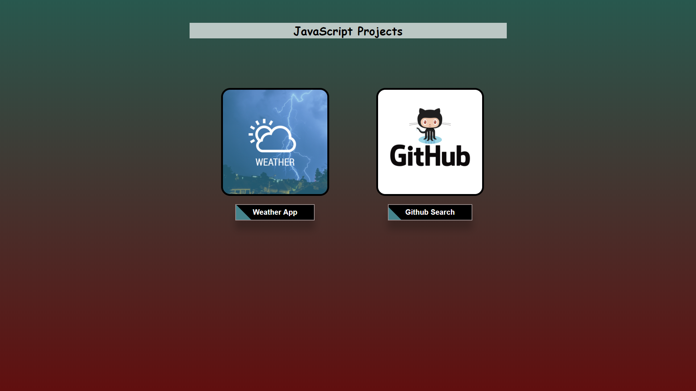
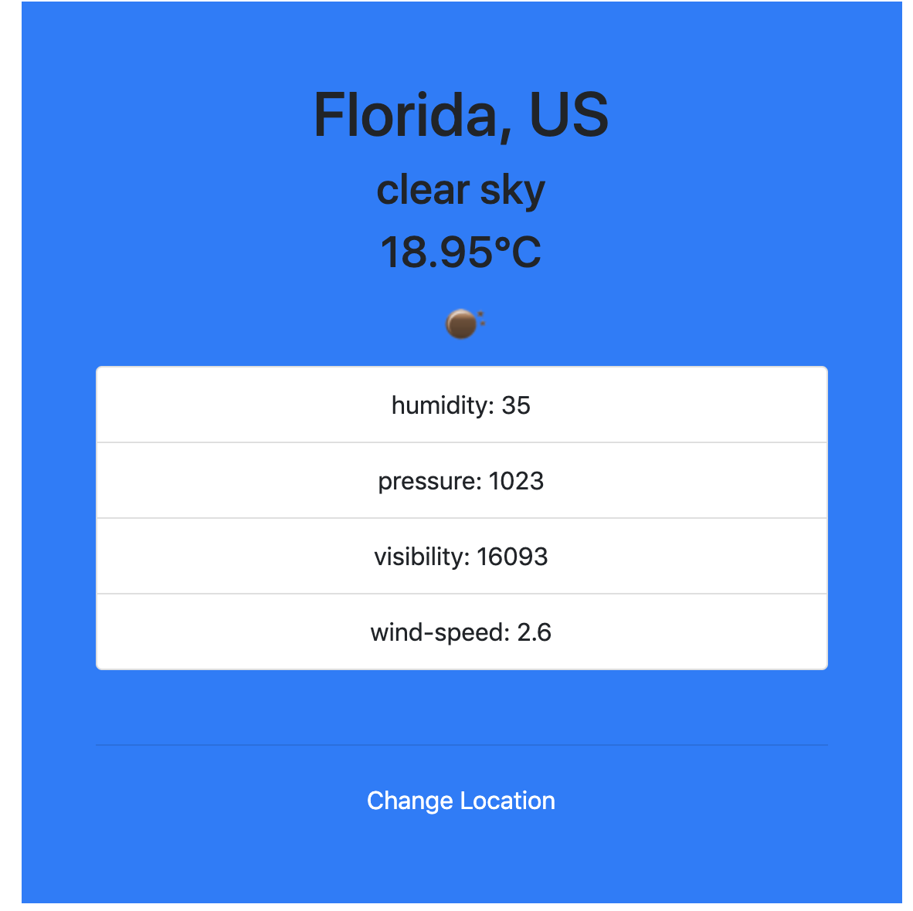
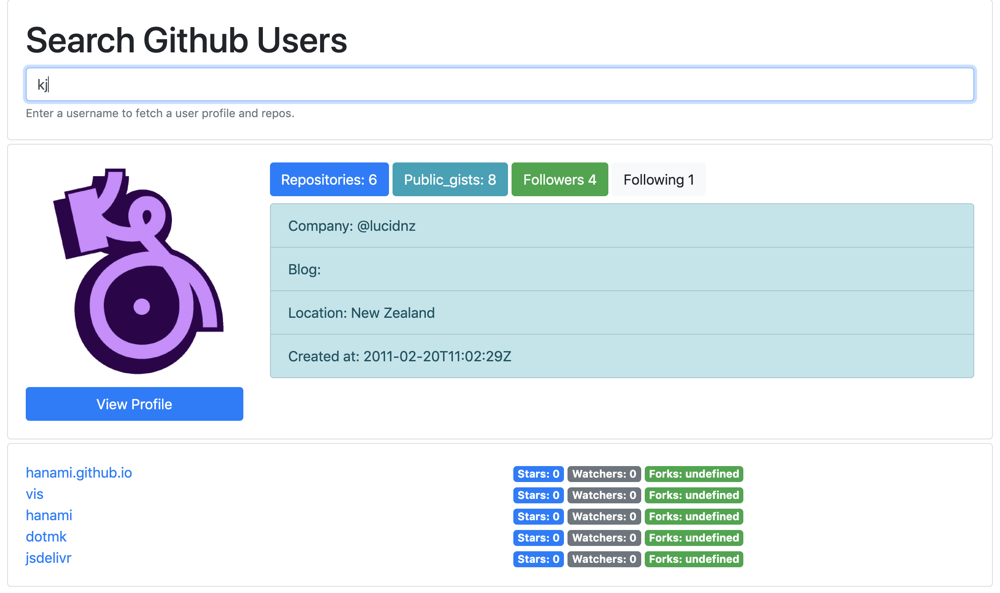

A mini projects using api 

Screenshot : 

# The first project 
***Weather App***

A simple weather api app that displays the weather for the current location.

Screenshot:

# The second project 
***Github profile finder***

A vanilla javascript application that uses github api to fetch the profile of github users based on their usernames.

javascript core functionalities used:

1. async/fetch/promises for handling asynchronous operations.
2. ES6 classes.
3. arrow functions.
4. String interpolation.

Other technologies used:

1. HTML
2. Bootstrap
3. CSS
4. JQuery

Screeshot of the application:

